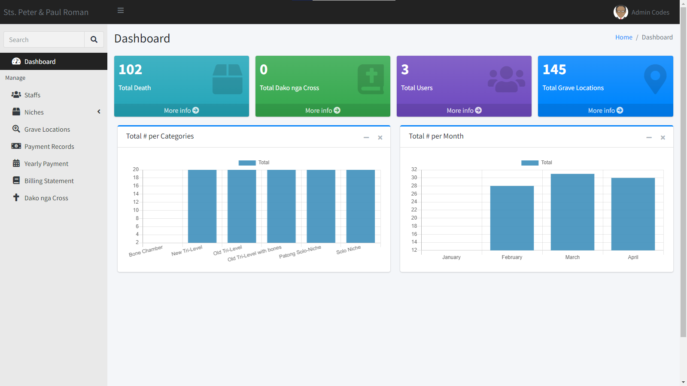

<h1 align="center">Cemetery Website</h1>

Date : March | 10 | 2023

# Documentation
 <a href="https://github.com/namcodes/Cemetery/raw/main/documentation.docx">Download Me!</a>
 
# Preview

  

# Requirements
- 🧠 Brain
- 🕸 Xampp, Wampp or any web server that supports mysql.
- 📝Code Editor (`Vscode`, `Sublime Text`) 
